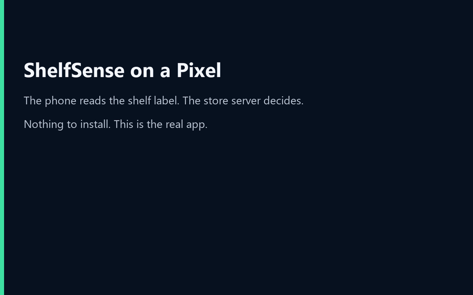
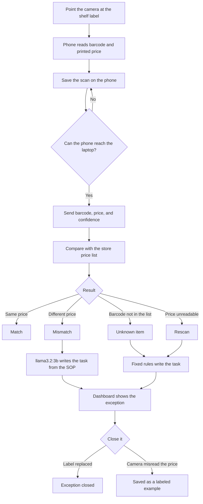

# ShelfSense

On-prem store server price compliance using an edge AI model.

An associate points an Android phone at a shelf label. The phone reads the barcode and the printed price on the device. A laptop in the store checks those numbers against the price list. When they disagree, **llama3.2:3b** (Meta Llama 3.2, 3 billion parameters, about 2 GB, running locally with Ollama on the store GPU) writes a short task from the store SOP. The photo never leaves the phone, and the model never leaves the store.

The price check is a rule, not a guess by the model. The model only writes the associate task after a mismatch.

## Watch the demo

No install. The clip below is the store dashboard reacting to real scans: a match, a price mismatch written by llama3.2:3b, then an unknown barcode and a blurry read.



[Download the MP4](presentation/demo.mp4) if you want the sharper copy.

## Flow



A printable version of this chart is in [presentation/shelfsense-flow.png](presentation/shelfsense-flow.png). The talk track is [presentation/ShelfSense_Demo.pptx](presentation/ShelfSense_Demo.pptx).

## What each side does

**Phone.** CameraX shows the label. ML Kit reads the barcode and the price on the device. Capture stores the scan in Room. WorkManager sends it when the network is up. Each scan has its own id, so a retry does not create a duplicate.

**Laptop.** FastAPI receives the barcode, the price in cents, and the OCR confidence. It compares them with `server/data/price_master.csv`:

| What arrived | Status |
|---|---|
| Price matches the list | Match. An open issue for that item is closed. |
| Price differs | Mismatch. Shelf lower than the system: fix within 1 hour. Shelf higher: fix within 4 hours. |
| Barcode is not in the list | Unknown item. |
| No price, or confidence under 0.60 | Rescan. |

For a mismatch, the server asks Ollama for two or three sentences grounded in `server/data/sop.md`. The dashboard at `GET /` shows the open exception. **Label replaced** closes it. **OCR misread** stores the real printed price for the model team at `GET /api/v1/feedback/ocr-misreads.jsonl`. If Ollama is down, the same kind of task is written from fixed rules and the source shows `rules`.

## How to run it

You need Python 3.10+, [Ollama](https://ollama.com/), and Android Studio (JDK 17 or newer) if you want the phone app.

### 1. Store server

```powershell
cd server
py -3.12 -m venv .venv
.\.venv\Scripts\Activate.ps1
pip install -r requirements.txt

ollama pull llama3.2:3b

$env:SHELFSENSE_API_KEY = "shelfsense-demo-key-2026"
python -m pytest -q
uvicorn app.main:app --host 0.0.0.0 --port 8000
```

Open http://127.0.0.1:8000, paste the API key, and click **Connect**. The header should say on-prem store server price compliance using an edge AI model, and name `llama3.2:3b`.

Let the phone reach the laptop on a private network:

```powershell
New-NetFirewallRule -DisplayName "ShelfSense 8000" -Direction Inbound -Protocol TCP -LocalPort 8000 -Profile Private -Action Allow
ipconfig
```

Use the Wi-Fi IPv4 address in the Android config below.

Optional environment variables: `OLLAMA_MODEL` (default `llama3.2:3b`), `OLLAMA_URL`, `SHELFSENSE_LLM_ENABLED=false`, `SHELFSENSE_DB`.

Print shelf labels. Two prices are deliberately wrong: AA Batteries 8pk is `$9.99` against a system price of `$10.99`, and Tissue Box Family Size is `$3.99` against `$3.49`.

```powershell
python make_labels.py
```

Open `labels.html` on a second screen.

Without a phone:

```powershell
python simulate_scans.py --server http://127.0.0.1:8000
```

### 2. Android app

The Android project is already a Gradle build (wrapper included). From `android/`:

Create `android/local.properties` and do not commit it:

```
sdk.dir=C:/Users/you/AppData/Local/Android/Sdk
shelfsense.baseUrl=http://192.168.1.50:8000/
shelfsense.apiKey=shelfsense-demo-key-2026
shelfsense.storeId=CHI-042
```

The URL needs a trailing slash. For the emulator use `http://10.0.2.2:8000/`.

```powershell
cd android
.\gradlew.bat :app:installDebug
.\gradlew.bat :app:testDebugUnitTest
```

Run it on a phone with a camera. Point at a label until the barcode and the price both appear, then tap **Capture**. On a rugged handheld with a hardware scanner, the trigger can fill the barcode while the camera still reads the price. On a regular phone the camera does both.

### 3. Walk the demo

1. Dashboard is empty. This laptop is the store server.
2. Scan a correct label, such as Cola 12pk at `$6.99`. It lands as a match. Only the barcode and the price crossed the network.
3. Scan AA Batteries. The label says `$9.99` and the system says `$10.99`. The dashboard shows a mismatch and a task from `llm:llama3.2:3b`. The one-hour deadline is because the shelf price is lower than the system price. Read the price columns first; the model only writes the paragraph.
4. Turn on airplane mode, scan two labels, turn Wi-Fi back on, and tap **Sync now**.
5. Stop Ollama (`Stop-Process -Name ollama`) and scan again. The task source becomes `rules`.
6. On a mismatch, choose **OCR misread** and enter the price that was actually printed. Fetch the labeled example:

```powershell
Invoke-RestMethod http://127.0.0.1:8000/api/v1/feedback/ocr-misreads.jsonl -Headers @{ "X-Api-Key" = $env:SHELFSENSE_API_KEY }
```

## Project layout

```
shelfsense/
├── README.md
├── LICENSE
├── NOTICE.md
├── presentation/          # flowchart PNG and demo deck
├── shelfsense_icon/       # original launcher artwork
├── server/
│   ├── app/               # FastAPI, price rules, Ollama client, dashboard
│   ├── data/              # price list and store SOP
│   └── tests/
└── android/               # CameraX, ML Kit, Room queue, WorkManager
```

## Production notes

- The API key in `BuildConfig` is for this demo. A real store would provision a per-device credential and use TLS.
- The release build already blocks cleartext HTTP.
- SQLite is enough for one store. Many stores would use Postgres and a separate rollup.
- ML Kit is the on-device reader in this demo. A production rollout would measure field accuracy from the misread feed before changing the vision model.
- `llama3.2:3b` is a small local writer for a templated task. Judge it on a fixed prompt set before swapping models.
